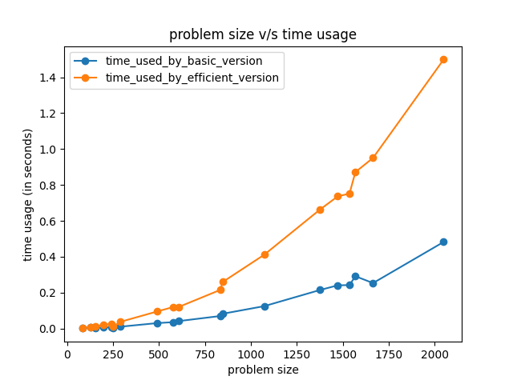
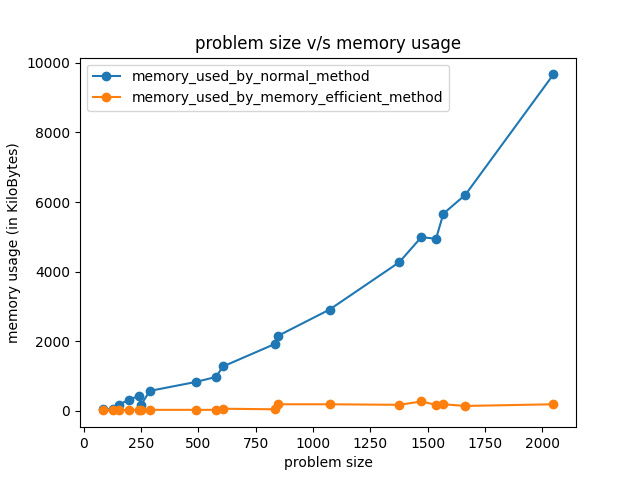

# Sequence Alignment Problem

### Summary

#### Algorithm
- The dynamic programming approach is used in the basic version of sequence alignment problem solution.
- The combination of `divide and conquer`, and `dynamic programming` is used in the efficient version of the sequence alignment algorithm. 
- Here, the problem is divided into sub problems and solve them recursively. 
- In each subproblem, The string `X` is split into half and 
the position `y_split_pos` is calculated by memory efficient version of sequence alignment to split `Y` string.
- Finally, the base case is to find out the alignment when length of `X` and `Y` is less than or equal to 2.

#### Complexity

##### Basic version
    Time Complexity: O(m*n)
    Space Complexity: O(m*n)

##### Efficient version
    Time Complexity: O(m*n)
    Space Complexity: O(m+n)

#### Time Comparison
- Time taken by efficient version is higher than the basic version of sequence alignment algorithm. 
- The overhead of recursion for divide and conquer, as well as the overhead for finding `y_split_pos` for `Y` string causes the time. 
for efficient algorithm to be little greater than basic version which contains only `m*n` iterations.
- Therefore, the overhead associated with the efficient algorithm causes the time to be a bit greater than the basic version.

#### Memory Comparison
- The efficient algorithm uses `2*k` (`k` being the size of `Y` string) array to calculate the minimum sequence alignment for every recursion in
`divide_and_conquer` method. Hence, the max memory allocated will be less than `2*n` (n is the max size of string `Y`).
- Whereas, in case of basic version, the memory allocated is `m*n`, which causes the memory size to increase linearly proportional to the input size.

### Contributors

Made with [contrib.rocks](https://contrib.rocks).

### Contributions

##### Coding
- Sameer Khan Mohammad (Memory Efficient Version)
- Manidhar Mulagapaka (String Generator)
- Namrata Vasant Naik (Basic Version)
##### Testing: 
- Namrata Vasant Naik
- Sameer Khan Mohammad

##### Report preparation
- Sameer Khan Mohammad
- Manidhar Mulagapaka
- Namrata Vasant Naik
  
##### Code Version Control
- Manidhar Mulagapaka
